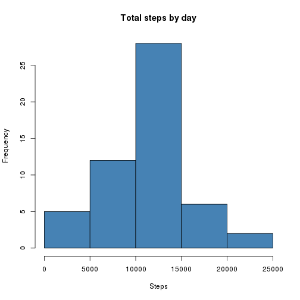
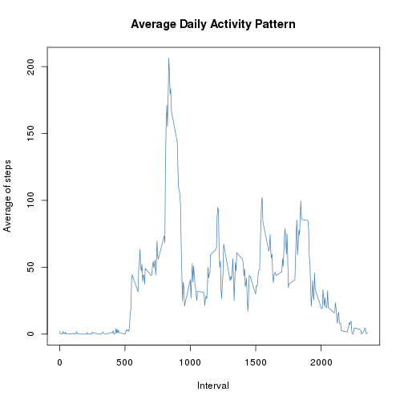
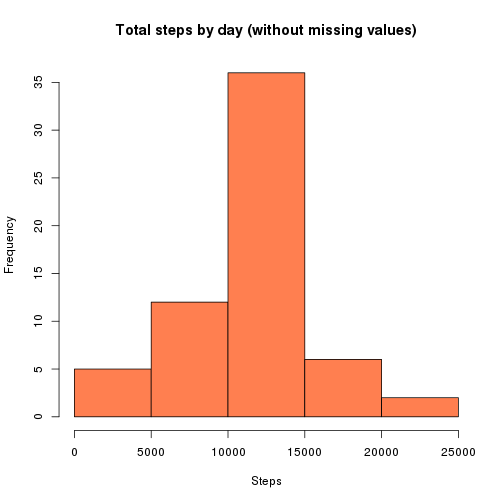
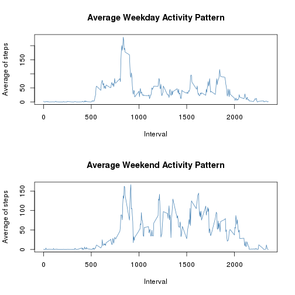

Activity Data Analysis
===========


## Introduction

This report is part of an assignment for the online course "Reproducible Research" imparted by Roger Peng, PhD with the Johns Hopkins University through the online platform Coursera.

The project consists on doing some data analysis and documenting the complete process in this report according to the concept of _Literate Statistical Programming_. The data to be analyzed comes from an activity monitoring device, which collected two months of data in 5 minute intervals during the months of October and November, 2012. The dataset contains the number of steps taken during each interval. (Peng, 2014)


## Part 1: Loading and preprocessing the data

The dataset for this analysis is the [Activity Monitoring Data](https://d396qusza40orc.cloudfront.net/repdata%2Fdata%2Factivity.zip) and it was downloaded from Cloudfront, unzipped and read into the R Environment using the following code:


```r
download.file("https://d396qusza40orc.cloudfront.net/repdata%2Fdata%2Factivity.zip","Activity Monitoring Data")
unzip("Activity Monitoring Data")
activityData <- read.csv("activity.csv")
```

No transformations of the data were required at this point.


## Part 2: Mean total number of steps taken per day

As instructed, missing values were ignored for this part of the assignment. This part of the assignment has 3 tasks.

### 2.1 Calculate the total number of steps taken per day

To do this calculation, the `aggregate()` function was used as follows:


```r
totalByDay <- aggregate(activityData$steps, by=list(activityData$date), FUN=sum)
head(totalByDay)
```

```
##      Group.1     x
## 1 2012-10-01    NA
## 2 2012-10-02   126
## 3 2012-10-03 11352
## 4 2012-10-04 12116
## 5 2012-10-05 13294
## 6 2012-10-06 15420
```

### 2.2 Make a histogram of the total number of steps taken per day

The `base` plotting system was used for this task.


```r
hist(totalByDay$x, main="Total steps by day", xlab="Steps", col="steelblue")
```



### 2.3 Calculate and report the mean and median total number of setps taken per day

Here's the code used for this calculation. Please notice the `na.rm` option set to `TRUE` in order to be able to calculate the numbers despite the missing values.


```r
meanTotalByDay <- mean(totalByDay$x, na.rm= TRUE)
medianTotalByDay <- median(totalByDay$x, na.rm= TRUE)
cat("The mean total number of steps taken per day is", meanTotalByDay, "steps, and the median total number of steps taken per day is", medianTotalByDay, "steps.")
```

```
## The mean total number of steps taken per day is 10766.19 steps, and the median total number of steps taken per day is 10765 steps.
```


## Part 3: What's the average daily activity pattern?

For this part of the assignment, a time series plot must be presented. The plot should include each 5 minute interval in the X-axis along with the average number of steps taken on that interval, across all days. Afterwards, the interval with the highest average across all days must be calculated and reported. Here's the code, using the `aggregate()` function once again, as well as the `base` plotting system.


```r
intervalAverageAcrossAllDays <- aggregate(activityData$steps, by = list(activityData$interval), FUN = mean, na.rm= TRUE)
head(intervalAverageAcrossAllDays)
```

```
##   Group.1         x
## 1       0 1.7169811
## 2       5 0.3396226
## 3      10 0.1320755
## 4      15 0.1509434
## 5      20 0.0754717
## 6      25 2.0943396
```

```r
plot(intervalAverageAcrossAllDays, type="l", main="Average Daily Activity Pattern", xlab= "Interval", ylab= "Average of steps", col= "steelblue")
```



```r
highestInterval <- intervalAverageAcrossAllDays$Group.1[intervalAverageAcrossAllDays$x == max(intervalAverageAcrossAllDays$x)]
highestAverage <- max(intervalAverageAcrossAllDays$x)
cat("The 5 minute interval with the highest average across all days is the", highestInterval, "interval, with", highestAverage, "steps.")
```

```
## The 5 minute interval with the highest average across all days is the 835 interval, with 206.1698 steps.
```


## Part 4: Imputing missing values

This section will try to introduce some values for the intervals in which they're missing. There are 4 tasks for this section.

### 4.1 Calculate and report the number of missing values in the dataset

This is easily accomplished by subsetting the dataset (using the `is.na()` function) and applying the `length()` function.


```r
missingValues <- length(activityData$steps[is.na(activityData$steps)])
cat("There are", missingValues, "values missing in the dataset.")
```

```
## There are 2304 values missing in the dataset.
```

### 4.2 Devise a strategy for filling in all the missing values in the dataset

My strategy was to use the rounded mean of each interval across all days. I think this makes more sense than using just the mean because otherwise it would mean that _fractional_ steps were taken, and that doesn't really make sense.

### 4.3 Create a new dataset, equal to the original but with the missing values filled in

Here's the code I used. I would've liked to implement a more elegant solution, but this works fine.


```r
filledData <- activityData
for(i in 1:length(filledData$steps))
  ifelse(is.na(filledData$steps[i]), filledData$steps[i] <- round(intervalAverageAcrossAllDays$x[intervalAverageAcrossAllDays$Group.1 == filledData$interval[i]]),next)
head(filledData)
```

```
##   steps       date interval
## 1     2 2012-10-01        0
## 2     0 2012-10-01        5
## 3     0 2012-10-01       10
## 4     0 2012-10-01       15
## 5     0 2012-10-01       20
## 6     2 2012-10-01       25
```


### 4.4 Make a histogram of the total number of steps taken per day, and calculate the mean and median


```r
totalByDayFilled <- aggregate(filledData$steps, by = list(filledData$date), FUN= sum)
hist(totalByDayFilled$x, main="Total steps by day (without missing values)", xlab="Steps", col="coral")
```



```r
meanTotalByDayFilled <- mean(totalByDayFilled$x)
medianTotalByDayFilled <- median(totalByDayFilled$x)
cat("The mean total number of steps taken per day is", meanTotalByDayFilled, "steps. The median is", medianTotalByDayFilled, "steps.")
```

```
## The mean total number of steps taken per day is 10765.64 steps. The median is 10762 steps.
```

The assignment asks _"Do these values differ from the estimates from the first part of the assignment?"_ And then it asks _"What is the impact of imputing the missing data on the estimates of the total daily number of steps?"_

The estimates don't differ much from those of the first part of the assignment. In both cases, the difference is less than 0.03%, so I don't think there's a very big impact on the estimates.

## Part 5: Are there differences in activity patterns between weekdays and weekends?

In this section, it's first required to include a new variable in the dataset to determine if the date corresponds to a regular week day or to a weekend day.

As suggested in the assignments, I used the `weekdays()` function to complete this part of the assignment. Please notice that it would've been better for this part of the assignment to transform the `date` variable in the dataset to a _proper_ date format, however I just decided to do the conversion as part of the loop.

Once again, I would've liked to implement a more elegant solution, but this works fine.


```r
for(day in filledData$date)
  ifelse(weekdays(strptime(day, "%Y-%m-%d")) %in% list("Saturday","Sunday"), filledData$WeekDay[filledData$date == day]<-"weekend", filledData$WeekDay[filledData$date == day]<-"weekday")
filledData$WeekDay <- as.factor(filledData$WeekDay)
head(filledData$WeekDay)
```

```
## [1] weekday weekday weekday weekday weekday weekday
## Levels: weekday weekend
```

The assignment finally asks to make a panel plot showing the difference between the regular week day activity pattern and the weekend day activity pattern.


```r
intervalAverageAcrossWeekdays <- aggregate(filledData$steps[filledData$WeekDay == "weekday"], by = list(filledData$interval[filledData$WeekDay == "weekday"]), FUN = mean)
intervalAverageAcrossWeekends <- aggregate(filledData$steps[filledData$WeekDay == "weekend"], by = list(filledData$interval[filledData$WeekDay == "weekend"]), FUN = mean)
par(mfrow = c(2,1))
plot(intervalAverageAcrossWeekdays, type="l", main="Average Weekday Activity Pattern", xlab= "Interval", ylab= "Average of steps", col= "steelblue")
plot(intervalAverageAcrossWeekends, type="l", main="Average Weekend Activity Pattern", xlab= "Interval", ylab= "Average of steps", col= "steelblue")
```



There seems to be more activity over the weekends than during regular week days.

## End of the assignment.

***
### References

(1) Peng, R. (2014). _Reproducible Research - Assignment: Course Project 1_. Retrieved on March 3rd, 2016, from Coursera. URL: https://www.coursera.org/learn/reproducible-research/peer/gYyPt/course-project-1
